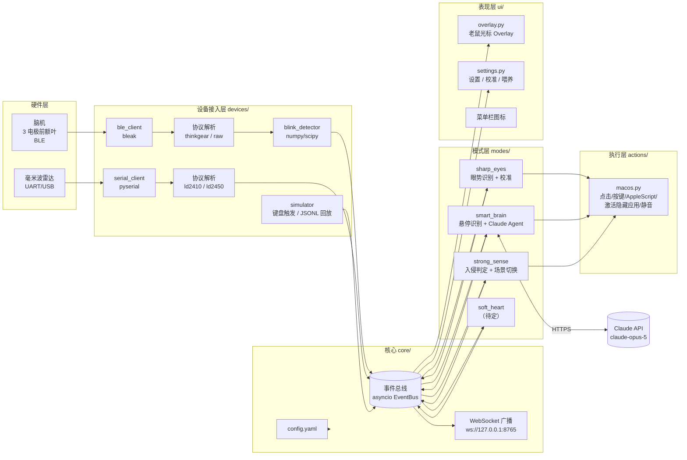

# 02 · 系统架构与技术方案

> 版本 v0.1 · 2026-09-11 · 状态：草稿
> 本文回答"系统怎么拆、用什么做、模块之间怎么说话"。硬件细节见文档 03，AI 细节见文档 04。

---

## 1. 架构总览



**设计原则**

1. **所有东西都是事件**：硬件、AI、UI 之间只通过事件总线通信，任何一环都能被模拟器替换 —— 这是 Demo 不翻车的保险。
2. **硬件协议隔离**：`devices/` 层把设备差异吃掉，上层只看到 `bci.blink`、`radar.frame` 这类语义事件；明天换型号只改一个解析文件。
3. **老鼠是唯一的反馈出口**：模式层不直接画 UI，只发 `mouse.state` 事件。

## 2. 技术选型

### 2.1 推荐方案：Python 单语言栈（macOS）

| 层 | 选型 | 理由 |
|---|---|---|
| 语言 | Python 3.11+ | BLE / 串口 / 信号处理 / Claude SDK 全部有成熟库，团队上手快，一个进程搞定 |
| BLE | `bleak` | 跨平台 BLE，macOS 走 CoreBluetooth，异步 API |
| 串口 | `pyserial` | 雷达 UART |
| 信号处理 | `numpy`、`scipy.signal` | 带通滤波、峰值检测 |
| AI | `anthropic`（官方 SDK） | Claude `claude-opus-5`，Tool Runner 驱动 Agent 循环，视觉理解截图 |
| UI / Overlay | `PyQt6` + `qasync` | 透明、置顶、鼠标穿透窗口做老鼠光标；`qasync` 把 asyncio 事件循环并入 Qt 主循环 |
| macOS 集成 | `pyobjc`（Quartz、ApplicationServices、AppKit） + `osascript` | 光标位置、输入合成、辅助功能查元素、AppleScript 控制应用 |
| 全局热键 | `pynput` | 模拟器热键、急停 |
| 配置 | `pyyaml` + `pydantic` | 配置校验 |
| 调试面板 | 浏览器打开 `tools/dashboard.html` 订阅 WebSocket | 实时看事件流、波形 |

### 2.2 备选方案与取舍

| 方案 | 优点 | 缺点 | 何时选 |
|---|---|---|---|
| Swift/SwiftUI 原生 Overlay + Python 设备 Hub（WebSocket 连接） | 动画最流畅、系统光标控制最自然、可上 App Store 级体验 | 两个进程两种语言，联调成本高 | 团队里有熟练 Swift 同学，且 Overlay 效果是主要评分点 |
| Electron / Tauri 前端 | Web 动画生态（Lottie/Rive）好看 | 透明穿透置顶窗口在 macOS 上坑多，包体大 | 团队全是前端 |
| 全 Python（推荐） | 一种语言、一个进程、模拟器最好做 | 动画手写 sprite sheet，精致度靠美术 | **默认** |

> 事件协议（§5）与 WebSocket 广播是为"随时切到方案一"预留的：Swift Overlay 只需订阅 `ws://127.0.0.1:8765`。

## 3. 进程与并发模型

单进程，Qt 主线程 + asyncio（通过 `qasync`）：

```
Qt 主线程 (qasync 事件循环)
 ├─ asyncio Task: BLE 接收 (bleak notify 回调 → 解析 → bus.publish)
 ├─ asyncio Task: 串口读取 (run_in_executor 阻塞读 → 解析 → bus.publish)
 ├─ asyncio Task: 眨眼检测 (512 Hz 数据，numpy 向量化，每 32 样本处理一次，< 1 ms)
 ├─ asyncio Task: 各模式订阅者 (eyes / brain / sense / heart)
 ├─ asyncio Task: WebSocket 广播
 ├─ asyncio Task: Claude API 调用 (anthropic AsyncAnthropic，或 run_in_executor)
 └─ QTimer 8 ms: Overlay 跟随光标 + 动画帧
```

- **Claude 调用**必须异步/线程化，绝不能卡住 Qt 主线程（老鼠会僵住）。
- 所有 `actions/macos.py` 的输入合成在主线程调用（Quartz 要求不严格，但保持简单）。
- 入口：

```python
# supermouse/__main__.py（骨架）
import asyncio, sys
import qasync
from PyQt6.QtWidgets import QApplication

async def main(app):
    bus = EventBus()
    cfg = load_config()
    overlay = MouseOverlay(bus); overlay.show()
    tasks = [
        asyncio.create_task(start_bci(cfg, bus)),
        asyncio.create_task(start_radar(cfg, bus)),
        asyncio.create_task(SharpEyes(cfg, bus).run()),
        asyncio.create_task(SmartBrain(cfg, bus).run()),
        asyncio.create_task(StrongSense(cfg, bus).run()),
        asyncio.create_task(ws_broadcaster(bus)),
    ]
    await asyncio.gather(*tasks)

if __name__ == "__main__":
    app = QApplication(sys.argv)
    app.setQuitOnLastWindowClosed(False)
    loop = qasync.QEventLoop(app)
    asyncio.set_event_loop(loop)
    with loop:
        loop.run_until_complete(main(app))
```

## 4. 模块划分与职责

| 模块 | 职责 | 输入事件 | 输出事件 | 负责人 |
|---|---|---|---|---|
| `core/bus.py` | 异步发布/订阅，按 `type` 前缀订阅（如 `bci.*`），记录到 JSONL | — | — | B |
| `core/config.py` | 读写 `config.yaml`，pydantic 校验，热更新 | — | `config.changed` | B |
| `devices/bci/*` | BLE 连接重连、协议解析、眨眼检测、信号质量 | — | `bci.connected/quality/blink/attention/raw` | A |
| `devices/radar/*` | 串口读取、帧解析 | — | `radar.connected/frame` | A |
| `devices/simulator.py` | 热键 → 伪事件；JSONL 回放 | 键盘 | 同上 | A/B |
| `modes/sharp_eyes` | 眼势状态机、校准、映射执行 | `bci.blink/quality` | `eye.gesture`、`mouse.state`、`action.*` | A |
| `modes/strong_sense` | 入侵判定、工作场景执行 | `radar.frame` | `sense.intruder/clear`、`mouse.state`、`action.*` | B |
| `modes/smart_brain` | 悬停识别、知识库、建议、Agent 执行 | 光标位置、`eye.gesture` | `brain.hover/suggest/action`、`mouse.state` | C |
| `modes/soft_heart` | （待定）眨眼频率、久坐 | `bci.blink`、`radar.frame` | `heart.remind` | 待定 |
| `actions/macos.py` | 点击、按键、AppleScript、激活/隐藏应用、静音、打开 URL、截图 | `action.*` | `action.done` | B |
| `ui/overlay.py` | 老鼠光标：跟随、动画状态机、牌子/气泡 | `mouse.state`、`brain.suggest` | `ui.click_suggest` | B/D |
| `ui/settings.py` | 设置、校准向导、喂养页、映射表 | — | `config.changed` | B/D |
| `tools/*` | 扫描、抓包、回放、看板 | — | — | A |

## 5. 事件总线与事件协议

### 5.1 总线 API

```python
class EventBus:
    def publish(self, type: str, **payload): ...          # 自动加 t=time.time()
    def subscribe(self, pattern: str, handler): ...       # "bci.*" / "radar.frame" / "*"
    async def stream(self, pattern: str): ...             # async for evt in bus.stream("bci.blink")
```

所有事件是扁平 JSON：`{"type": "...", "t": 1757563200.123, ...payload}`，可以直接写入 JSONL 并回放。

### 5.2 事件字典

| type | 字段 | 说明 |
|---|---|---|
| `bci.connected` | `device`, `protocol` | 连接成功 |
| `bci.disconnected` | `reason` | 断开（自动重连） |
| `bci.quality` | `poor_signal` 0–200 | 0 = 良好；> 50 视为不可靠，禁用眼势 |
| `bci.raw` | `fs`, `samples[]` | 原始 EEG 块（仅内部 / 调试面板，不走 JSONL 除非 `--record-raw`） |
| `bci.blink` | `strength` 0–1, `duration_ms`, `source` `device|raw` | 单次眨眼 |
| `bci.attention` | `value` 0–100 | 设备给出的专注度（如有） |
| `eye.gesture` | `gesture` `double_blink|triple_blink|hard_blink|long_blink` | 识别出的眼势 |
| `eye.calibrated` | `thresholds{}` | 校准完成 |
| `radar.connected` | `port`, `model` | |
| `radar.frame` | `state` `none|moving|static|both`, `moving_cm`, `moving_energy`, `static_cm`, `static_energy`, `targets[]{x_mm,y_mm,speed_cms,dist_mm}` | 单目标字段来自 LD2410；`targets` 来自 LD2454/LD2450 或 MicroPython BridgeTextParser；解析器尽量两者都填 |
| `sense.intruder` | `distance_m`, `approaching` bool | 身后有人 |
| `sense.clear` | | 身后清空 |
| `brain.hover` | `app` bundle id, `title`, `kind` `dock|window|file`, `path?`, `dwell_ms` | 悬停识别 |
| `brain.suggest` | `plan_id`, `app`, `title`, `steps[]` | 老鼠举牌 |
| `brain.confirm` | `plan_id`, `via` `gesture|click` | 用户确认 |
| `brain.action` | `plan_id`, `status` `running|done|error`, `progress`, `message` | 执行进度 |
| `brain.cancel` | `plan_id` | 淡出/取消 |
| `heart.remind` | `kind` `blink|posture|break`, `message` | 第四模式提醒 |
| `action.click` | `button`, `count` | 在当前光标位置点击 |
| `action.keys` | `combo` 如 `"cmd+tab"` | 组合键 |
| `action.scene` | `scene` | 执行场景动作序列 |
| `action.done` | `ref`, `ok`, `error?` | 动作回执 |
| `mouse.state` | `anim` 见 PRD §3.1, `label?`, `ttl_ms?` | 老鼠动画/牌子 |
| `ui.click_suggest` | `plan_id` | 用户点击牌子 |
| `sys.stop_all` | | 全局急停（Esc Esc） |

## 6. 配置文件规范

路径 `~/.supermouse/config.yaml`（首次启动从 `supermouse/default_config.yaml` 复制）：

```yaml
devices:
  bci:
    transport: ble               # ble | serial | sim
    name_prefix: "BrainLink"     # 扫描时按名称前缀匹配，到货后填
    protocol: thinkgear          # thinkgear | raw | vendor_xxx
    notify_char: "0000ffe1-0000-1000-8000-00805f9b34fb"   # 到货后用 ble_scan.py 确认
    fs: 512
  radar:
    transport: serial            # serial | sim
    port: auto                   # CH340K 1A86:7522；多个候选时指定实际端口
    connection: micropython
    baud: 115200                 # 板→主机；雷达→板仍为 256000
    model: bridge                # MicroPython 中文文本，非二进制 ld2454
    facing: forward              # 当前探测区包含本人，人数阈值 2

eyes:
  enabled: true
  calibration:
    natural_p95: 0.35            # 校准写入
    intent_p50: 0.70
    hard_threshold: 0.55
    double_gap_ms: [120, 450]
    long_ms: 400
  refractory_ms: 500
  gestures:
    double_blink: { action: click }
    triple_blink: { action: keys, combo: "cmd+tab" }
    hard_blink:   { action: brain_confirm, fallback: { action: scene, scene: work } }
    long_blink:   { action: toggle_scroll }

brain:
  enabled: true
  model: claude-opus-5
  knowledge_dir: ~/.supermouse/brain
  hover_dwell_ms: 700
  suggest_ttl_ms: 1500
  confirm: [hard_blink, double_blink, click]
  repeat_cooldown_s: 30
  allowed_dirs: [~/Documents/hackathon, ~/Desktop]
  apps:
    com.apple.mail:            { skill: mail_draft_replies }
    com.microsoft.VSCode:      { skill: vscode_open_todo, project: ~/Documents/hackathon }
    com.apple.Notes:           { skill: notes_daily_report }
    com.google.Chrome:         { skill: browser_morning_tabs, urls: [ "https://github.com/notifications", "https://calendar.google.com" ] }

sense:
  enabled: true
  intruder_target_count: 2
  max_frame_gap_s: 0.5
  zone_m: [0.8, 4.0]
  min_frames: 3
  approach_speed_mps: 0.3
  cooldown_s: 20
  clear_s: 10
  only_when_slacking: true
  fun_apps: [tv.danmaku.bili, com.tencent.xinWeChat, com.apple.TV]
  work_scene:
    - { do: hide_apps, apps: fun_apps }
    - { do: activate, app: com.microsoft.VSCode }
    - { do: mute }
    # - { do: space, index: 2 }
    # - { do: open_url, url: "https://..." }
  restore_on_clear: ask         # ask | auto | never

mouse:
  skin: default
  hide_system_cursor: true      # 依赖 Mousecape 空白光标包
  sounds: true
  scale: 1.0

sim:
  hotkeys:                      # 无硬件时的模拟器
    double_blink: f13
    triple_blink: f14
    hard_blink: f15
    intruder: f16
    clear: f17
```

## 7. 目录结构

```
Super Mouse/
├── README.md
├── docs/                          # 本文档集
├── pyproject.toml                 # 依赖：bleak pyserial numpy scipy anthropic PyQt6 qasync pyobjc pynput pyyaml pydantic websockets
├── supermouse/
│   ├── __main__.py                # 入口：python -m supermouse [--sim] [--record] [--replay file]
│   ├── default_config.yaml
│   ├── core/
│   │   ├── bus.py                 # EventBus + JSONL 录制
│   │   ├── config.py
│   │   └── ws.py                  # WebSocket 广播
│   ├── devices/
│   │   ├── bci/
│   │   │   ├── ble_client.py      # bleak 连接/重连/notify
│   │   │   ├── thinkgear.py       # ThinkGear 字节流解析（若设备为该协议）
│   │   │   ├── blink_detector.py  # 原始 EEG → 眨眼事件
│   │   │   └── vendor_xxx.py      # 到货后若为私有协议，在此实现
│   │   ├── radar/
│   │   │   ├── serial_client.py
│   │   │   ├── ld2410.py
│   │   │   └── ld2450.py
│   │   └── simulator.py           # 热键伪事件 + JSONL 回放
│   ├── modes/
│   │   ├── sharp_eyes/  {gestures.py, calibration.py, mapping.py}
│   │   ├── strong_sense/ {presence.py, scenes.py}
│   │   ├── smart_brain/  {hover.py, knowledge.py, suggest.py, agent.py, tools.py, skills/}
│   │   └── soft_heart/   {monitor.py}     # 待定
│   ├── actions/
│   │   └── macos.py               # 输入合成 / AppleScript / 应用控制 / 截图
│   └── ui/
│       ├── overlay.py             # 老鼠光标
│       ├── sprites.py             # sprite sheet 加载与动画状态机
│       ├── settings.py            # 设置窗口（Tab：设备 / 眼势 / 大脑 / 感知 / 老鼠）
│       ├── menubar.py
│       └── assets/sprites/*.png   # 每个状态一张横向 sprite sheet，64×64/帧
├── tools/
│   ├── ble_scan.py                # 扫描并打印 name/address/services
│   ├── ble_dump.py                # 订阅 notify 打印 hex，识别协议
│   ├── serial_dump.py             # 打印雷达原始帧
│   ├── replay.py                  # 回放 recordings/*.jsonl 到总线
│   └── dashboard.html             # 浏览器调试面板（WebSocket）
└── recordings/                    # 到货后录 30 s 真实数据作 fallback
```

## 8. macOS 系统集成要点

### 8.1 权限（Demo 机必须提前授权）

| 权限 | 用途 | 授权对象 |
|---|---|---|
| 蓝牙 | bleak 扫描/连接 | 终端（Terminal/iTerm）或打包后的 App |
| 辅助功能（Accessibility） | 合成点击/按键、读取光标下元素 | 同上 |
| 屏幕录制 | 截图给 Claude 看 | 同上 |
| 自动化（Automation） | AppleScript 控制 System Events、Mail 等 | 同上 → 每个目标 App 首次会弹窗，**演示前全部点过** |
| 输入监控 | pynput 全局热键（模拟器/急停） | 同上 |

> 建议：Demo 前一天用**同一个终端 App** 跑通所有流程，让所有权限弹窗都出现并同意；系统设置 → 隐私与安全性里逐项核对。

### 8.2 老鼠光标 Overlay

- 窗口标志：`FramelessWindowHint | WindowStaysOnTopHint | Tool | WindowTransparentForInput | WindowDoesNotAcceptFocus`，属性 `WA_TranslucentBackground`、`WA_ShowWithoutActivating`。
- `QTimer` 8 ms 读 `QCursor.pos()`，`move()` 到 `(x - hotspot_x, y - hotspot_y)`；动画帧由独立 `QTimer`（12 fps sprite）驱动。
- 多显示器：`QCursor.pos()` 为全局坐标，天然支持。
- 隐藏 Dock 图标：`NSApp.setActivationPolicy_(NSApplicationActivationPolicyAccessory)`（pyobjc）。
- **隐藏系统光标**：
  1. 首选：安装 [Mousecape](https://github.com/alexzielenski/Mousecape)，导入一个全透明的 `.cape`（仓库 `ui/assets/cursors/blank.cape`，需自己制作：所有光标类型用 1×1 透明 PNG），应用后系统光标全局不可见；
  2. 备选：Mousecape 直接做一套静态老鼠光标（各种状态用不同姿势），Overlay 只做表情/牌子/气泡；
  3. 兜底："伴随模式"，保留系统箭头，老鼠鼻尖贴箭头尖端。
- 牌子/气泡：同一 Overlay 窗口内绘制（窗口尺寸放大为 320×160，热点位置不变），避免多窗口同步问题。

### 8.3 输入合成

```python
import Quartz
def click(x, y, button="left", count=1):
    down, up = (Quartz.kCGEventLeftMouseDown, Quartz.kCGEventLeftMouseUp) if button == "left" \
               else (Quartz.kCGEventRightMouseDown, Quartz.kCGEventRightMouseUp)
    for i in range(1, count + 1):
        for kind in (down, up):
            ev = Quartz.CGEventCreateMouseEvent(None, kind, (x, y), Quartz.kCGMouseButtonLeft)
            Quartz.CGEventSetIntegerValueField(ev, Quartz.kCGMouseEventClickState, i)
            Quartz.CGEventPost(Quartz.kCGHIDEventTap, ev)
```

- 组合键：`CGEventCreateKeyboardEvent` + `CGEventSetFlags`（`kCGEventFlagMaskCommand` 等），键码表放 `actions/keycodes.py`；简单场景直接用 `pynput.keyboard.Controller`。
- 切换 Space：系统设置 → 键盘快捷键 → 调度中心 → 勾选"切换到桌面 N"，然后合成 `ctrl+N`。

### 8.4 应用控制（AppleScript / 命令行）

```python
import subprocess
def osa(script: str) -> str:
    return subprocess.run(["osascript", "-e", script], capture_output=True, text=True, timeout=5).stdout.strip()

def activate(bundle_id):      subprocess.run(["open", "-b", bundle_id])
def hide_app(bundle_id):      osa(f'tell application "System Events" to set visible of (every process whose bundle identifier is "{bundle_id}") to false')
def mute():                   osa("set volume output muted true")
def frontmost_bundle():       return osa('tell application "System Events" to get bundle identifier of first process whose frontmost is true')
def open_url(url):            subprocess.run(["open", url])
def screenshot(path):         subprocess.run(["screencapture", "-x", "-C", path])   # 需屏幕录制权限
```

> `hide_app` 首次会触发"自动化 → System Events"授权弹窗。

### 8.5 光标下元素识别（Smart Brain 悬停）

```python
from ApplicationServices import (AXUIElementCreateSystemWide, AXUIElementCopyElementAtPosition,
                                 AXUIElementGetPid, AXUIElementCopyAttributeValue)
from AppKit import NSRunningApplication, NSBundle

SYS = AXUIElementCreateSystemWide()

def element_under_cursor(x, y):
    err, el = AXUIElementCopyElementAtPosition(SYS, x, y, None)
    if err or el is None: return None
    _, pid = AXUIElementGetPid(el, None)
    _, role = AXUIElementCopyAttributeValue(el, "AXRole", None)
    _, title = AXUIElementCopyAttributeValue(el, "AXTitle", None)
    app = NSRunningApplication.runningApplicationWithProcessIdentifier_(pid)
    info = {"pid": pid, "role": role, "title": title, "app": app.bundleIdentifier() if app else None}
    if role == "AXDockItem":                       # 悬停 Dock 图标：目标是图标代表的 App
        _, url = AXUIElementCopyAttributeValue(el, "AXURL", None)
        if url:
            b = NSBundle.bundleWithURL_(url)
            info.update(kind="dock", app=b.bundleIdentifier() if b else None, path=url.path())
    return info
```

坐标系：AX 与 `QCursor.pos()` 都是左上角原点的全局坐标，直接传。

## 9. 模拟器与回放（保命机制）

- `python -m supermouse --sim`：不连硬件，`F13–F17` 触发伪事件（见配置 `sim.hotkeys`），Overlay/模式/动作链路完全一致。
- `--record`：把总线所有事件（默认不含 `bci.raw`）写到 `recordings/<时间戳>.jsonl`；到货后**立刻录 30 s 真实数据**。
- `--replay recordings/x.jsonl [--speed 1.0]`：按时间戳回放，可在没有设备的电脑上开发模式层。
- 演示时若硬件掉线，老鼠头顶显示"⚡"，按 `⌥⌘S` 一键切换到模拟器，流程不中断。

## 10. 日志与调试

- `--debug` 打开 WebSocket 广播（`ws://127.0.0.1:8765`）与 `tools/dashboard.html`：实时波形（`bci.raw`）、事件流、雷达距离曲线、老鼠状态。
- 日志用标准 `logging`，文件 `~/.supermouse/logs/`，设备层 DEBUG 级打印 hex 帧（可关）。
- Demo 时可把 dashboard 投到第二块屏幕，评委能看到"脑电 → 眨眼 → 动作"的全链路。

## 11. 依赖与安装

```toml
# pyproject.toml（节选）
[project]
name = "supermouse"
requires-python = ">=3.11"
dependencies = [
  "bleak>=0.22", "pyserial>=3.5", "numpy>=1.26", "scipy>=1.11",
  "anthropic>=0.40", "PyQt6>=6.6", "qasync>=0.27",
  "pyobjc-framework-Quartz", "pyobjc-framework-ApplicationServices", "pyobjc-framework-Cocoa",
  "pynput>=1.7", "pyyaml", "pydantic>=2", "websockets>=12",
]
```

- Python 3.11 用 `brew install python@3.11` 或 uv；PyQt6 在 Apple Silicon 直接 pip 即可。
- 串口若为 CH340 芯片，macOS 13+ 自带驱动；更老系统需装 WCH 驱动。
- Claude API Key：`export ANTHROPIC_API_KEY=...`（或 `ant auth login`），不要写进仓库。

## 12. 待决策

1. 是否采用推荐方案（Python + PyQt6）。
2. 老鼠美术：sprite sheet 由谁产出？建议今天先用占位图（圆形老鼠 + 简单眨眼），美术并行。
3. Mousecape 空白光标包由 B 同学今晚验证可行性，不行则走"伴随模式"。
