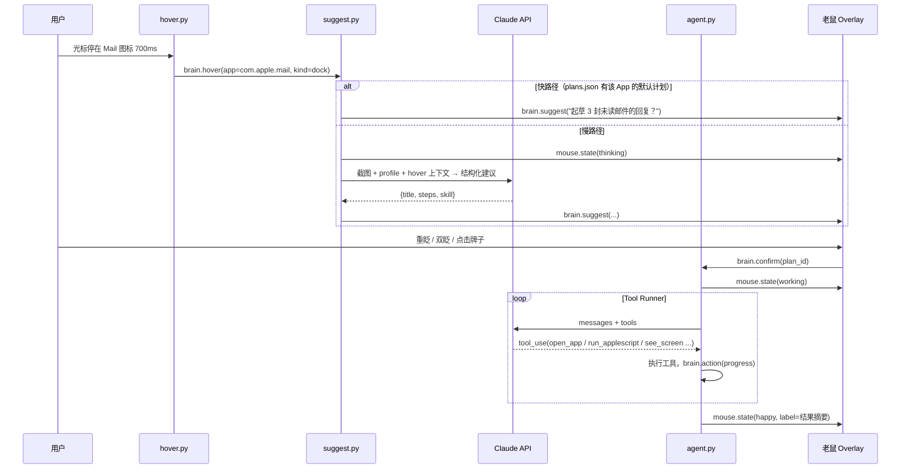

# 04 · Smart Brain —— AI 设计

> 版本 v0.1 · 2026-09-11 · 状态：草稿
> 读者：负责 AI / Agent 的同学。模型与 SDK 用法以本文为准（已按当前 Anthropic SDK 核对）。

---

## 1. 目标与体验流程



**延迟预算**：悬停 700 ms → 建议 ≤ 1.5 s（快路径 0 ms）→ 用户确认 → 执行按步骤流式反馈。

## 2. 知识喂养（knowledge.py）

### 2.1 输入

- 设置界面"喂养"页：自由文本（我是谁 / 在做什么 / 常用 App 里希望它做什么）；
- 文件与目录：`.md .txt .pdf`（`pypdf` 抽文本）、代码目录（只取目录树 + README + `TODO`）；
- 全部复制到 `~/.supermouse/brain/raw/`，索引写 `manifest.json`。

### 2.2 输出：`profile.md` + `plans.json`

喂养完成后调用一次 Claude 生成：

- `profile.md`（≤ 3000 字）：身份与角色、当前项目、每个 App 的使用习惯与期望、明确禁止事项；
- `plans.json`：每个已配置 App 的**默认计划**（快路径），格式同 §4 的 `Suggestion`。

```python
# modes/smart_brain/knowledge.py（节选）
import anthropic
client = anthropic.Anthropic()

def build_profile(raw_text: str) -> str:
    with client.messages.stream(                      # 输出可能较长，用流式避免超时
        model="claude-opus-5",
        max_tokens=16000,
        thinking={"type": "adaptive"},
        output_config={"effort": "medium"},
        system=PROFILE_SYSTEM_PROMPT,
        messages=[{"role": "user", "content": f"<materials>\n{raw_text}\n</materials>\n请生成 profile.md。"}],
    ) as stream:
        msg = stream.get_final_message()
    return "".join(b.text for b in msg.content if b.type == "text")
```

原始材料若超过 ~150k tokens（`client.messages.count_tokens` 估算），按文件分批总结再合并——黑客松场景基本不会遇到。

## 3. 悬停识别（hover.py）

- 每 100 ms 读光标位置；位移 < 6 px 视为静止，累计静止时长 `dwell_ms`；
- 静止 ≥ `hover_dwell_ms`（700）时调用文档 02 §8.5 的 `element_under_cursor()`，得到 `{app, kind, title, path}`；
- 过滤：`app == frontmost` 且 `kind != file` → 忽略；同一 `(app, path)` 在 `repeat_cooldown_s` 内 → 忽略；`brain.enabled == false` → 忽略；
- 发布 `brain.hover`。光标离开（位移 > 40 px）→ 发布 `brain.cancel`，牌子淡出。

## 4. 建议生成（suggest.py）

### 4.1 结构化输出

```python
from pydantic import BaseModel

class Suggestion(BaseModel):
    title: str            # 牌子文案，≤ 20 字，问句
    skill: str | None     # 内置技能名（如 mail_draft_replies），None = 无内置技能，由 Agent 自由组合工具
    args: dict            # 技能参数
    steps: list[str]      # 执行时展示的步骤（3–5 条）
    needs_confirm: bool   # 是否包含不可逆动作（发送/删除等）
```

### 4.2 慢路径调用（带截图）

```python
import base64, anthropic
client = anthropic.Anthropic()

def suggest(profile_md: str, hover: dict, screenshot_png: bytes) -> Suggestion:
    img = base64.standard_b64encode(screenshot_png).decode()
    resp = client.messages.parse(
        model="claude-opus-5",
        max_tokens=1024,
        thinking={"type": "adaptive"},
        output_config={"effort": "low"},               # 悬停建议要快
        system=[
            {"type": "text", "text": SUGGEST_SYSTEM_PROMPT},
            {"type": "text", "text": f"<profile>\n{profile_md}\n</profile>",
             "cache_control": {"type": "ephemeral"}},   # profile 稳定不变 → 缓存
        ],
        messages=[{"role": "user", "content": [
            {"type": "image", "source": {"type": "base64", "media_type": "image/png", "data": img}},
            {"type": "text", "text": f"用户光标悬停在：{hover}\n当前时间：{now_str()}\n给出一个最有价值的建议。"},
        ]}],
        output_format=Suggestion,
    )
    return resp.parsed_output
```

- 截图先用 Pillow 缩到长边 ≤ 1280 px（省 token、更快）；
- 调用放在线程池（`loop.run_in_executor`），超时 6 s → 回退快路径 / 放弃建议；
- **缓存提示**：`system` 里 profile 段放在最后并加 `cache_control`，`messages` 里放变化内容（截图、时间），保证前缀稳定。

### 4.3 快路径

`plans.json[app]` 存在 → 直接发 `brain.suggest`，不调 API。演示时默认走快路径（可预测、零延迟），慢路径用于"文件悬停 → 总结这个文档"等开放场景。

## 5. 执行 Agent（agent.py + tools.py + skills/）

### 5.1 工具集（`@beta_tool`）

| 工具 | 签名 | 说明 / 安全限制 |
|---|---|---|
| `open_app` | `(bundle_id) -> str` | `open -b`；仅白名单 App |
| `open_url` | `(url) -> str` | 仅 http/https |
| `run_applescript` | `(script) -> str` | 脚本中出现的 `tell application "X"` 的 X 必须在白名单；超时 10 s |
| `press_keys` | `(combo) -> str` | 如 `"cmd+n"`；禁止 `cmd+q` 以外的危险组合按需扩展 |
| `type_text` | `(text) -> str` | 通过剪贴板 + `cmd+v` 粘贴（比逐键快且支持中文） |
| `read_file` / `list_dir` | `(path) -> str` | 仅 `brain.allowed_dirs` 内；文件 ≤ 200 KB |
| `see_screen` | `(question) -> str` | 截图 → 嵌套一次视觉调用回答问题（让工具返回值保持字符串） |
| `notify` | `(message) -> str` | 更新老鼠牌子，发 `brain.action(progress)` |
| `ask_confirm` | `(question) -> str` | 阻塞等待用户重眨/点击（超时 15 s 视为拒绝）；不可逆动作前必须调用 |
| 内置技能 | `mail_draft_replies()`、`vscode_open_todo(project)`、`notes_daily_report()`、`browser_morning_tabs(urls)`、`summarize_file(path)` | 高层"配方"，先写 AppleScript 保证 Demo 稳定 |

```python
# modes/smart_brain/tools.py（节选）
import subprocess
from anthropic import beta_tool
from supermouse.actions import macos

@beta_tool
def open_app(bundle_id: str) -> str:
    """打开或激活一个 macOS 应用。

    Args:
        bundle_id: 应用的 bundle identifier，例如 com.apple.mail。
    """
    if bundle_id not in ALLOWED_APPS:
        return f"拒绝：{bundle_id} 不在允许列表"
    macos.activate(bundle_id)
    return f"已激活 {bundle_id}"

@beta_tool
def see_screen(question: str) -> str:
    """截取当前屏幕并回答关于屏幕内容的问题。

    Args:
        question: 想从屏幕上了解的内容，例如"列出收件箱里未读邮件的发件人和主题"。
    """
    png = macos.screenshot_bytes(max_width=1280)
    return vision_answer(png, question)        # 嵌套 messages.create，见 §4.2 的图片写法
```

### 5.2 执行循环（Tool Runner）

```python
# modes/smart_brain/agent.py（节选）
import anthropic
from .tools import ALL_TOOLS

client = anthropic.Anthropic()

def run_plan(profile_md: str, suggestion: Suggestion, on_progress) -> str:
    runner = client.beta.messages.tool_runner(
        model="claude-opus-5",
        max_tokens=16000,
        thinking={"type": "adaptive"},
        output_config={"effort": "medium"},
        system=[
            {"type": "text", "text": AGENT_SYSTEM_PROMPT},
            {"type": "text", "text": f"<profile>\n{profile_md}\n</profile>",
             "cache_control": {"type": "ephemeral"}},
        ],
        tools=ALL_TOOLS,
        messages=[{"role": "user", "content":
            f"执行以下计划：{suggestion.title}\n步骤：{suggestion.steps}\n技能：{suggestion.skill} 参数：{suggestion.args}\n"
            "完成后用一句话（≤ 30 字）总结结果。"}],
    )
    final = None
    for message in runner:                         # 每轮一个 BetaMessage；SDK 自动执行工具并回填结果
        final = message
        for block in message.content:
            if block.type == "tool_use":
                on_progress(f"正在 {block.name}…")
    return "".join(b.text for b in final.content if b.type == "text") if final else ""
```

- 在 asyncio 里用 `await loop.run_in_executor(None, run_plan, ...)`；`on_progress` 通过 `loop.call_soon_threadsafe` 发 `brain.action` 事件。
- 收到 `sys.stop_all` 或 `sense.intruder` → 设置取消标志，工具函数在入口检查并返回 `"已被用户中止"`，循环自然结束。
- 所有工具调用写入 `~/.supermouse/logs/agent.jsonl`（时间、工具、参数、返回）便于复盘。

### 5.3 Claude API 使用规范（本项目约定）

| 项 | 约定 |
|---|---|
| 模型 | 统一 `claude-opus-5`（建议/执行/视觉/喂养） |
| 思考 | `thinking={"type": "adaptive"}`（Opus 5 默认即自适应，可省略；**不要**用 `budget_tokens`） |
| 力度 | 悬停建议 `effort: low`；执行 `medium`；喂养生成 `medium`；复杂多步任务可升 `high` |
| 流式 | 输出可能超过几千 token 的调用（喂养）用 `messages.stream()` + `get_final_message()` |
| 结构化 | 用 `client.messages.parse(output_format=PydanticModel)`；手写 JSON Schema 时用 `messages.create(output_config={"format": {...}})`；不要用 assistant prefill 控制格式 |
| 缓存 | profile 放 `system` 末尾并加 `cache_control`；检查 `resp.usage.cache_read_input_tokens > 0` |
| 图片 | PNG base64，长边 ≤ 1280 px |
| 超时 | 建议 6 s、执行单次请求 60 s（`client.with_options(timeout=...)`），失败最多重试 2 次（SDK 默认） |
| 密钥 | `ANTHROPIC_API_KEY` 环境变量；演示机提前 `export`，不入库 |

## 6. Prompt 草稿

### 6.1 SUGGEST_SYSTEM_PROMPT

```
你是 Super Mouse——一只住在用户光标里的老鼠助手。用户把光标停在了某个应用或文件上，你要根据
<profile> 中对用户工作的理解和当前屏幕截图，提出【一个】此刻最有价值、可以立刻代劳的行动。

要求：
- title 是一句 ≤ 20 字的中文问句，口吻像可爱的小助手，例如"要我起草这 3 封邮件的回复吗？"
- 优先选择 profile 中用户对该应用的明确期望；没有则根据屏幕内容推断
- 只提出你用现有技能/工具能完成的事；不确定的信息不要编造（如邮件数量看不到就不写数字）
- 任何发送、删除、支付、发布类动作 needs_confirm = true，且 steps 中最后一步必须是"等待用户确认后再发送"
```

### 6.2 AGENT_SYSTEM_PROMPT

```
你是 Super Mouse 的执行大脑，通过工具在用户的 macOS 上完成一个已被用户确认的小任务。
原则：
1. 先看后做：不确定屏幕状态时用 see_screen 确认，再操作。
2. 最小动作：能用内置技能就不用逐步操作；能用 AppleScript 就不模拟按键。
3. 只到草稿：邮件/消息只创建草稿，不发送；文件只新建不删除；如确需不可逆动作，先 ask_confirm。
4. 每完成一步调用 notify 告诉用户进度（≤ 15 字）。
5. 遇到登录框、密码框、验证码：停止并用 notify 说明，绝不输入凭据。
6. 结束时用一句 ≤ 30 字的中文总结你做了什么。
```

## 7. 安全与确认策略

| 风险 | 控制 |
|---|---|
| 误操作用户的应用 | App 白名单（`brain.apps` 的 key + 系统基础 App）；目录白名单 |
| 不可逆动作 | `needs_confirm` + `ask_confirm` 工具；Demo 期一律"只到草稿" |
| 失控循环 | Tool Runner 单次任务限时 90 s、工具调用 ≤ 25 次（计数器超限返回错误让模型收尾） |
| 敏感信息进模型 | 截图不落盘；日志不记录截图；密码框检测（AX 元素 `AXSecureTextField`）时拒绝 `type_text` |
| 急停 | `Esc Esc` / 菜单栏"停止"→ `sys.stop_all` |

## 8. 离线 / 断网 Fallback（演示保命）

- 所有 API 调用捕获异常与超时；失败时：
  - 建议阶段 → 走快路径 `plans.json`；
  - 执行阶段 → 若 `suggestion.skill` 非空，**直接调用内置技能函数**（纯 AppleScript，不需要模型）；
  - 老鼠牌子显示"离线模式 🐭"。
- 现场准备手机热点；演示前 `python tools/api_check.py` 做一次 1-token 请求确认联通。

## 9. 验收

- 喂养 3 个文件 + 一段自我介绍后，`profile.md` 内容准确，`plans.json` 覆盖所有配置的 App。
- 悬停 Mail/VS Code/Notes/Chrome 图标：快路径 100% 出建议，≤ 100 ms。
- 悬停一个 Markdown 文件：慢路径 ≤ 2 s 出"总结这个文档？"。
- 确认后 Mail 技能 ≤ 20 s 创建草稿，牌子展示进度与总结。
- 断网情况下，Mail 技能仍可通过内置配方完成。
- `Esc Esc` 能在执行中途 1 s 内停止。
